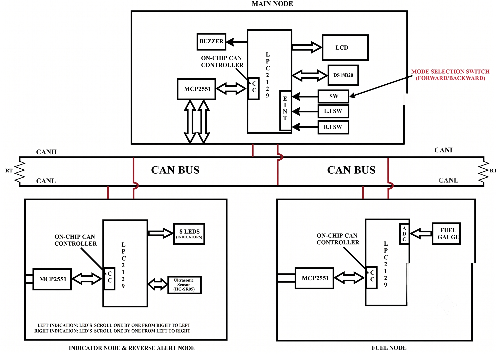

# LPC2129 CAN Based Vehicle Monitoring System



## Overview

This project demonstrates vehicle monitoring and control built from **three
independent embedded nodes** that talk to each other over a single **CAN bus**.

Each node is a separate LPC2129 (ARM7TDMI) board running its own firmware image.
There is no shared processor and no serial link between them - all coordination
happens through CAN frames on a CANH/CANL bus, with an **MCP2551** transceiver
between each MCU's on-chip CAN controller and the bus.

The system covers three classic in-vehicle services:

* **Engine temperature** (DS18B20 1-Wire sensor)
* **Fuel level** (potentiometric fuel sensor on the ADC)
* **Reverse / parking proximity alert** (HC-SR04 ultrasonic distance sensor)

...plus left/right indicator control driven from the cockpit switches.

---

## System Architecture


### MAIN NODE

The cockpit / HMI node. It owns the user switches and the display.

* **DS18B20** digital temperature sensor (1-Wire) for engine temperature
* **LCD** 20x4 character display showing temperature, fuel, mode and reverse status
* **Mode selection switch** (FORWARD / BACKWARD) on an external interrupt
* **Left indicator** and **Right indicator** switches, also on external interrupts
* **CAN** - transmits indicator commands, receives fuel level and reverse status

### REVERSE / INDICATOR NODE

The rear node. It actuates the indicators and watches for obstacles.

* **8 LEDs** used as left/right indicator bars (scrolling chase effect)
* **Ultrasonic sensor (HC-SR04)** for obstacle distance
* Derives a **SAFE / WARNING / STOP** reverse status from the measured distance
* **CAN** - receives indicator commands, transmits reverse status

### FUEL NODE

The fuel-tank node.

* **ADC** channel reading an analog fuel gauge sensor
* Converts the raw ADC count to a **fuel percentage**
* **LCD** shows the raw ADC value, the percentage and a low-fuel warning
* **CAN** - transmits the fuel percentage

---

## CAN Communication

All application messages are **standard CAN data frames** with **DLC = 1**.

| CAN ID | Sender | Receiver | Data1 |
| ------ | ------ | -------- | ----- |
| `0x100` | Main | Reverse | Indicator command |
| `0x101` | Fuel | Main | Fuel percentage |
| `0x102` | Reverse | Main | Reverse status |

* `Data1` (the first 4 data bytes, `C1TDA` / `C1RDA`) carries the application value.
* `Data2` is unused and is always written as `0`.
* All three nodes run the same `can_defines.h` and `can_ids.h`, so the bit timing
  and the message IDs cannot drift apart between nodes.

### Application values carried in `Data1`

| Message | Value | Meaning |
| ------- | ----- | ------- |
| `0x100` | `0` | `IND_OFF` - no indicator command pending |
| `0x100` | `1` | `IND_LEFT` - scroll left indicator |
| `0x100` | `2` | `IND_RIGHT` - scroll right indicator |
| `0x101` | `0..100` | Fuel percentage |
| `0x102` | `0` | `SAFE` - clear path |
| `0x102` | `1` | `WARNING` - obstacle in mid range |
| `0x102` | `2` | `STOP` - obstacle close, or sensor not responding |

Each node configures its acceptance filter to **accept all identifiers**
(`AFMR = 2`) and then discards frames it does not own in software. This keeps a
single shared driver simple while still keeping the application message map clean.

---

## CAN Timing

The bit timing is computed at compile time in `CAN_Project/can_defines.h` and is
shared verbatim by all three nodes.

| Parameter | Value |
| --------- | ----- |
| FOSC (crystal) | 12 MHz |
| CCLK | 60 MHz |
| VPBDIV | 0 |
| PCLK (peripheral / CAN clock) | 15 MHz |
| CAN bit rate | 125 kbps |
| QUANTA (time quanta per bit) | 20 |
| BRP (baud rate prescaler) | 6 |
| TSEG1 | 13 tq |
| TSEG2 | 6 tq |
| SJW | 4 tq |
| Sample point | 70 % |
| SAM | 0 (bus sampled once) |
| **C1BTR (BTR_LVAL)** | **`0x005CC005`** |

`PCLK / BIT_RATE = 15 000 000 / 125 000 = 120 = BRP x QUANTA = 6 x 20`,
which is why `QUANTA = 20` was chosen - `QUANTA = 16` would have needed
`BRP = 7.5`, which is not possible.

---

## Hardware / Pin Configuration

All pin assignments below were read directly from the source files. Each node is
a **separate board**, so the same LPC2129 pin number may be reused for a
different peripheral on different nodes.

### Main node

| Function | Pin | Source |
| -------- | --- | ------ |
| Mode switch | `P0.1` -> EINT0 -> VIC14 | `switch.c` |
| Left indicator switch | `P0.3` -> EINT1 -> VIC15 | `switch.c` |
| Right indicator switch | `P0.7` -> EINT2 -> VIC16 | `switch.c` |
| LCD data `D0-D7` | `P0.8 - P0.15` | `LCD_DEF.c` |
| LCD `RS` | `P0.16` | `LCD_DEF.c` |
| LCD `EN` | `P0.18` | `LCD_DEF.c` |
| LCD `RW` | tied to GND | `LCD_DEF.c` |
| DS18B20 `DQ` | `P0.17` (`OW_PIN 17`, 4.7k pull-up to 3.3 V) | `onewire.h` |
| CAN1 `RX` (RD1) | `P0.25` | `can_defines.h` |
| CAN1 `TX` (TD1) | dedicated CAN1 TX pin | `can.c` |

`P0.17` is usable by the DS18B20 only because the LCD `RW` pin is strapped to GND,
leaving `P0.17` free on the Main node.

### Reverse / Indicator node

| Function | Pin | Source |
| -------- | --- | ------ |
| Indicator LEDs (active low) | `P0.4 - P0.7` | `LED_BLINK.c` |
| Ultrasonic `TRIG` | `P0.16` | `LED_BLINK.h` |
| Ultrasonic `ECHO` | `P0.17` | `LED_BLINK.h` |
| CAN1 `RX` (RD1) | `P0.25` | `can_defines.h` |

### Fuel node

| Function | Pin | Source |
| -------- | --- | ------ |
| ADC analogue inputs enabled | `P0.27 - P0.30` (`PINSEL1 |= 0x15400000`) | `ADC_defines.c` |
| ADC channel actually read | `CH0` | `FUEL.c` |
| LCD data `D0-D7` | `P0.8 - P0.15` | `LCD_DEF.c` |
| LCD `RS` / `EN` | `P0.16` / `P0.18` | `LCD_DEF.c` |
| CAN1 `RX` (RD1) | `P0.25` | `can_defines.h` |

### Other

| Function | Value | Source |
| -------- | ----- | ------ |
| Timer0 prescaler (ultrasonic timing) | `T0PR = 14` -> ~1 us per tick at PCLK = 15 MHz | `REVERSE.c` |
| ADC clock divider | `ADCLK = 3 MHz` | `ADC_defines.h` |

---

## Software / Tools

| Tool / Component | Role |
| ---------------- | ---- |
| **Keil uVision** (ARM-ADS toolset) | IDE, project files and compiler driver |
| **ARMCC / ARM-ADS compiler** | Builds the C sources for ARM7TDMI |
| **LPC2129** (NXP, ARM7TDMI) | Target MCU, all three nodes |
| **Embedded C** | Entire firmware, bare-metal, no RTOS |
| **Keil Startup.s** | Vector table, stack setup, PLL / VPBDIV / MAM init |
| **MCP2551** | CAN transceiver between MCU and bus |
| **Proteus** | *not part of this repository* |


---

## Project Structure

All three firmware images live in **one flat folder**, `CAN_Project/`. Keil
project files reference their sources with relative paths (`.\file.c`), so the
whole folder must be kept together - moving files between folders will break the
projects.

```
.
|-- README.md
|-- .gitignore
|-- docs/
|   `-- project-overview.svg      System block diagram
`-- CAN_Project/
    |-- CAN.uvproj                MAIN node      -> CAN.hex
    |-- REVERSE.uvproj            REVERSE node   -> REVERSE.hex
    |-- FUEL.uvproj               FUEL node      -> FUEL.hex
    |
    |-- CAN_Main.c                Main node application
    |-- REVERSE.c                 Reverse / indicator node application
    |-- FUEL.c                    Fuel node application
    |
    |-- Startup.s                 Keil LPC2000 startup (vectors, PLL, VPBDIV, MAM)
    |
    |-- can.c / can.h             CAN1 driver: Init_CAN1, CAN1_Tx, CAN1_Rx, overrun recovery
    |-- can_defines.h             SHARED: CAN1 pin mask + bit timing (BTR_LVAL)
    |-- can_ids.h                 SHARED: CAN message map (0x100 / 0x101 / 0x102)
    |
    |-- switch.c / switch.h       External interrupts for the three cockpit switches
    |-- ds18b20.c / ds18b20.h     DS18B20 temperature sensor
    |-- onewire.c / onewire.h     1-Wire bus (bit level protocol)
    |-- LCD_DEF.c / lcd.h         HD44780 character LCD driver
    |-- LED_BLINK.c / LED_BLINK.h Indicator LEDs + Timer0 helper + shared enums
    |-- reverse_def.c / .h        HC-SR04 ultrasonic measurement
    |-- ADC_defines.c / .h        ADC initialisation and single-channel conversion
    |-- delay.c / delay.h         Simple blocking delay loops
    `-- type.h / types.h          Fixed-width integer typedefs
```

### Shared drivers

`can.c`, `can_defines.h` and `can_ids.h` are deliberately shared by all three
projects. This guarantees that every node uses the same bit timing and the same
message IDs - the single most common source of failure in multi-node CAN designs.


---

## How It Works

```
        Main  --->  0x100  --->  Reverse
        Fuel   --->  0x101  --->  Main
        Reverse ---> 0x102  --->  Main
```

### Main node

1. The three switches are wired to **external interrupt** pins, so a press is
   captured immediately by the CPU rather than being polled.
   The ISRs in `switch.c` only set flags (`indicator`, `mode`); the CAN work is
   done later in the main loop.
2. `Service_CAN()` drains the receive buffer completely and stores the newest
   fuel percentage and reverse status.
3. `Service_Indicator()` sends a **single** `0x100` frame per switch press,
   and only while in `FORWARD` mode. In `REVERSE` the pending command is
   discarded so it does not fire later.
4. The DS18B20 conversion normally takes ~750 ms. That wait is deliberately
   **split into 75 slices of 10 ms**, and CAN servicing runs inside every slice,
   so incoming fuel and reverse frames are never left waiting in the
   controller's receive buffer.
5. The LCD is refreshed with temperature, fuel percentage, mode and - in
   `REVERSE` mode - the reverse status.

### Reverse node

1. Drains the receive buffer; frames that are not `0x100` are ignored.
2. An `IND_LEFT` or `IND_RIGHT` command scrolls the 4-LED bar one LED at a time
   (100 ms per LED) in the requested direction.
3. Triggers the HC-SR04 and measures the echo width with Timer0 at a 1 us tick.
4. Maps the distance to a status:
   `> 50 cm` -> `SAFE`, `> 20 cm` -> `WARNING`, otherwise `STOP`.
5. Sends the status as `0x102`, then waits 100 ms before the next cycle.

### Fuel node

1. Reads the ADC and clamps it to the calibrated sensor range
   (`ADC_EMPTY = 85` ... `ADC_FULL = 700`).
2. Scales it to `0..100 %`.
3. Shows the raw ADC value, the percentage and a `LOW` warning below 20 % on the
   LCD.
4. Sends the percentage as `0x101` every 200 ms.

---

## Build

The firmware is built with **Keil uVision**. There is no Makefile, CMake project
or CI build in this repository - VS Code is used only as an editor here.

1. Open Keil uVision.
2. `File > Open Project...` and select one of:
   * `CAN_Project/CAN.uvproj` - Main node
   * `CAN_Project/REVERSE.uvproj` - Reverse / indicator node
   * `CAN_Project/FUEL.uvproj` - Fuel node
3. Confirm the target device is **LPC2129** (`Options for Target > Device`).
4. `Project > Rebuild all target files`.

Each project writes its output next to the sources
(`OutputDirectory = .\`) and `CreateHexFile` is enabled, so you get:

| Project | Output |
| ------- | ------ |
| `CAN.uvproj` | `CAN.hex` |
| `REVERSE.uvproj` | `REVERSE.hex` |
| `FUEL.uvproj` | `FUEL.hex` |

Flash each `.hex` to the matching board. Build all three before testing, because
a node will only be able to talk to the others if all three share the same bit
timing.

---

## Features

Implemented in this repository:

* Three-node CAN network on a shared bus with a shared, compile-time-checked
  bit-timing definition
* 125 kbps standard data frames, `DLC = 1`, single application value in `Data1`
* Mode switch (FORWARD / BACKWARD) on external interrupt EINT0
* Left and right indicator switches on external interrupts EINT1 / EINT2
* Indicator commands transmitted as `0x100` only in FORWARD mode
* 4-LED-per-side scrolling indicator chase effect, left and right
* HC-SR04 ultrasonic distance measurement with a hardware-timed echo width
* SAFE / WARNING / STOP reverse classification with a fail-safe `STOP` when the
  sensor does not answer at all
* Reverse status transmitted as `0x102` at roughly 10 frames/s
* DS18B20 1-Wire engine temperature with a missing-sensor indication
* ADC fuel sensing with calibration range `85..700` scaled to `0..100 %`
* Fuel percentage transmitted as `0x101` every 200 ms
* 20x4 LCD showing temperature, fuel percentage, mode and reverse status
* Low-fuel warning below 20 % on the fuel node
* CAN receive overrun detection with automatic controller re-initialisation
  (`CAN_OVERRUN_RECOVERY` in `can_defines.h`)
* Non-blocking DS18B20 wait so CAN reception is never starved for more than
  ~10 ms

---
Pravin Patil
