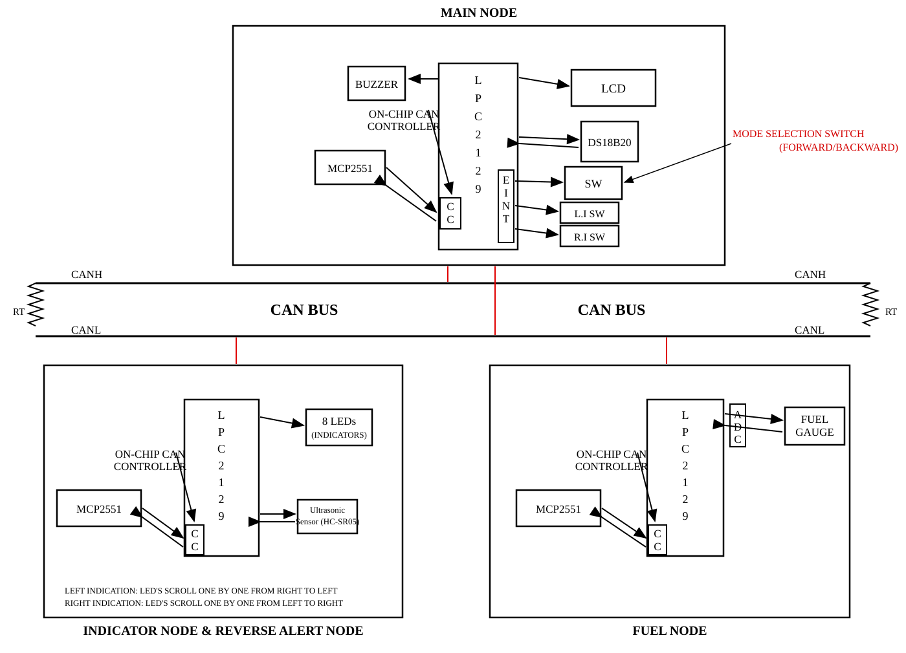

# LPC2129 CAN Based Vehicle Monitoring System



## Overview

This project demonstrates vehicle monitoring and control built from **three
independent embedded nodes** that talk to each other over a single **CAN bus**.

Each node is a separate LPC2129 (ARM7TDMI) board running its own firmware image.
There is no shared processor and no serial link between them - all coordination
happens through CAN frames on a CANH/CANL bus, with an **MCP2551** transceiver
between each MCU's on-chip CAN controller and the bus.

The system covers three classic in-vehicle services:

* **Engine temperature** (DS18B20 1-Wire sensor)
* **Fuel level** (potentiometric fuel sensor on the ADC)
* **Reverse / parking proximity alert** (HC-SR04 ultrasonic distance sensor)

...plus left/right indicator control driven from the cockpit switches.

---

## System Architecture


### MAIN NODE

The cockpit / HMI node. It owns the user switches and the display.

* **DS18B20** digital temperature sensor (1-Wire) for engine temperature
* **LCD** 20x4 character display showing temperature, fuel, mode and reverse status
* **Mode selection switch** (FORWARD / REVERSE) on an external interrupt
* **Left indicator** and **Right indicator** switches, also on external interrupts
* **CAN** - transmits indicator commands, receives fuel level and reverse status

### REVERSE / INDICATOR NODE

The rear node. It actuates the indicators and watches for obstacles.

* **Four LEDs** (`P0.4` - `P0.7`) forming a single indicator bar, run as a
  scrolling chase effect
* **Ultrasonic sensor (HC-SR04)** for obstacle distance
* Derives a **SAFE / WARNING / STOP** reverse status from the measured distance
* **CAN** - receives indicator commands, transmits reverse status

> The block diagram labels this bar as "8 LEDs". The firmware drives **four**
> pins (`P0.4` - `P0.7`); see `LED_BLINK.c`. The diagram reflects the intended
> hardware, the code reflects what is implemented.

### FUEL NODE

The fuel-tank node.

* **ADC** channel reading an analog fuel gauge sensor
* Converts the raw ADC count to a **fuel percentage**
* **LCD** shows the raw ADC value, the percentage and a low-fuel warning
* **CAN** - transmits the fuel percentage

### Buzzer

The block diagram shows a **buzzer** on the Main node. This is **planned hardware
only - it is not implemented in the firmware**. There is no buzzer driver, no
output pin assignment and no reference to a buzzer anywhere in `CAN_Project/`.

---

## CAN Communication

All application messages are **standard CAN data frames** with **DLC = 1**.

| CAN ID | Sender | Receiver | Data1 |
| ------ | ------ | -------- | ----- |
| `0x100` | Main | Reverse | Indicator command |
| `0x101` | Fuel | Main | Fuel percentage |
| `0x102` | Reverse | Main | Reverse status |

* `Data1` (the first 4 data bytes, `C1TDA` / `C1RDA`) carries the application value.
* `Data2` is unused and is always written as `0`.
* All three nodes run the same `can_defines.h` and `can_ids.h`, so the bit timing
  and the message IDs cannot drift apart between nodes.

### Application values carried in `Data1`

| Message | Value | Meaning |
| ------- | ----- | ------- |
| `0x100` | `0` | `IND_OFF` - no indicator command pending |
| `0x100` | `1` | `IND_LEFT` - scroll left indicator |
| `0x100` | `2` | `IND_RIGHT` - scroll right indicator |
| `0x101` | `0..100` | Fuel percentage |
| `0x102` | `0` | `SAFE` - clear path |
| `0x102` | `1` | `WARNING` - obstacle in mid range |
| `0x102` | `2` | `STOP` - obstacle close, or sensor not responding |

Each node configures its acceptance filter to **accept all identifiers**
(`AFMR = 2`) and then discards frames it does not own in software. This keeps a
single shared driver simple while still keeping the application message map clean.

---

## CAN Timing

The bit timing is computed at compile time in `CAN_Project/can_defines.h` and is
shared verbatim by all three nodes.

### Design intent - the configuration the firmware is written against

| Parameter | Value |
| --------- | ----- |
| FOSC (crystal) | 12 MHz |
| CCLK | 60 MHz |
| VPBDIV | 0 |
| PCLK (peripheral / CAN clock) | 15 MHz |
| CAN bit rate | 125 kbps |
| QUANTA (time quanta per bit) | 20 |
| BRP (baud rate prescaler) | 6 |
| TSEG1 | 13 tq |
| TSEG2 | 6 tq |
| SJW | 4 tq |
| Sample point | 70 % |
| SAM | 0 (bus sampled once) |
| **C1BTR (BTR_LVAL)** | **`0x005CC005`** |

`PCLK / BIT_RATE = 15 000 000 / 125 000 = 120 = BRP x QUANTA = 6 x 20`,
which is why `QUANTA = 20` was chosen - `QUANTA = 16` would have needed
`BRP = 7.5`, which is not possible.

The 15 MHz PCLK assumption is stated independently in four places in the source,
so it is unambiguously the configuration the firmware is written against:

* `can_defines.h` - `#define PCLK 15000000`
* `ADC_defines.h` - `#define CCLK (5*FOSC)` with `#define PCLK (CCLK/4)`
* `REVERSE.c` - `T0PR = 14`, commented as giving 1 us at PCLK = 15 MHz
* `delay.c` - the `* 12000` loop count only yields 1 ms at a 60 MHz CCLK

`C1BTR` is not hand-typed. It is assembled from `SAM`, `TSEG1`, `TSEG2`, `SJW`
and `BRP`, and `can_defines.h` carries `#error` guards that fail the build if the
prescaler is not a whole number or falls outside the LPC2129 limits.

### Startup file: recorded values and an open question

`Startup.s` is treated as read-only project configuration and has **not** been
modified by this review. Its actual contents are recorded here so that nothing has
to be guessed later:

| Startup.s symbol | Value | Effect |
| ---------------- | ----- | ------ |
| `PLL_SETUP` | `1` | the PLL block is executed |
| `PLLCFG_Val` | `0x00000024` | see below |
| `VPBDIV_SETUP` | `0` | the `VPBDIV` write is **skipped** by its `IF VPBDIV_SETUP <> 0` guard, so the register keeps its reset value of 0 -> VPB clock = CPU clock / 4 |
| `MAM_SETUP`, `MAMCR_Val`, `MAMTIM_Val` | `1`, `0x02`, `0x04` | MAM fully enabled, 4 fetch wait states |

`Startup.s` in this repository is byte-for-byte identical (SHA-256
`A7C35953E69581CFCE12EC198E820509CA000FC9A228103E8BE344F90207E3C1`) to the stock
Keil `STARTUP\Philips\Startup.s` shipped with uVision. It is the **unmodified
Config Wizard default** and was never reconfigured for this board.

Decoding `0x00000024` using the field layout that the same file documents in its
Config Wizard block (`<o1.0..4> MSEL` with `<1-32><#-1>`, `<o1.5..6> PSEL` with
`<0=>1 <1=>2 <2=>4 <3=>8>`) yields **M = 5, P = 2**, which from a 12 MHz crystal
means **CCLK = 30 MHz** and therefore PCLK = 7.5 MHz. That contradicts the
60 MHz / 15 MHz intent above, and if 30 MHz were the effective clock the CAN bit
rate would be 62.5 kbps instead of 125 kbps.

This has deliberately **not** been "fixed", because resolving it means editing
`Startup.s`, which is out of scope. Since all three nodes use the identical
`Startup.s`, the three nodes agree with each other either way; the only practical
consequence is the absolute bit rate on the wire. Confirm it on the bench (or by
reading the PLL status registers) before connecting the bus to anything else.
See the hardware checklist below.

---

## Hardware / Pin Configuration

All pin assignments below were read directly from the source files. Each node is
a **separate board**, so the same LPC2129 pin number may be reused for a
different peripheral on different nodes.

### Main node

| Function | Pin | Source |
| -------- | --- | ------ |
| Mode switch | `P0.1` -> EINT0 -> VIC14 | `switch.c` |
| Left indicator switch | `P0.3` -> EINT1 -> VIC15 | `switch.c` |
| Right indicator switch | `P0.7` -> EINT2 -> VIC16 | `switch.c` |
| LCD data `D0-D7` | `P0.8 - P0.15` | `LCD_DEF.c` |
| LCD `RS` | `P0.16` | `LCD_DEF.c` |
| LCD `EN` | `P0.18` | `LCD_DEF.c` |
| LCD `RW` | tied to GND | `LCD_DEF.c` |
| DS18B20 `DQ` | `P0.17` (`OW_PIN 17`, 4.7k pull-up to 3.3 V) | `onewire.h` |
| CAN1 `RX` (RD1) | `P0.25` | `can_defines.h` |
| CAN1 `TX` (TD1) | dedicated CAN1 TX pin | `can.c` |

`P0.17` is usable by the DS18B20 only because the LCD `RW` pin is strapped to GND,
leaving `P0.17` free on the Main node.

### Reverse / Indicator node

| Function | Pin | Source |
| -------- | --- | ------ |
| Indicator LEDs, active low (`IOCLR0` = on) | `P0.4` - `P0.7` (four pins) | `LED_BLINK.c` |
| Ultrasonic `TRIG` | `P0.16` | `LED_BLINK.h` |
| Ultrasonic `ECHO` | `P0.17` | `LED_BLINK.h` |
| CAN1 `RX` (RD1) | `P0.25` | `can_defines.h` |

Chase directions are set by the loop bounds in `LED_BLINK.c`:

* `Blink_left()`  - `for(i = 4; i < 8; i++)` -> `P0.4` -> `P0.7`
* `Blink_right()` - `for(i = 7; i > 3; i--)` -> `P0.7` -> `P0.4`

### Fuel node

| Function | Pin | Source |
| -------- | --- | ------ |
| ADC channel selected | `CH0`, which is `AD0.0` on **`P0.25`** | `FUEL.c` |
| ADC analogue pins enabled | `P0.27` - `P0.30` (`AD0.2` - `AD0.5`) via `PINSEL1 \|= 0x15400000` | `ADC_defines.c` |
| LCD data `D0-D7` | `P0.8 - P0.15` | `LCD_DEF.c` |
| LCD `RS` / `EN` | `P0.16` / `P0.18` | `LCD_DEF.c` |
| CAN1 `RX` (RD1) | `P0.25` | `can_defines.h` |

> **Open point, not changed.** `FUEL.c` reads `CH0`, which on the LPC2129 is
> `AD0.0` = `P0.25`. On this node `P0.25` is also configured as `CAN1_RD1` by
> `Init_CAN1()`. Meanwhile `ADC_Init()` enables the analogue function on
> `P0.27` - `P0.30` (`AD0.2` - `AD0.5`), none of which is the channel being read.
> Both `PINSEL1` writes target different bits so neither overwrites the other,
> but the channel actually being sampled is `P0.25`. Which pin the fuel sensor is
> really wired to must be confirmed on the board before this node is trusted.

### Other

| Function | Value | Source |
| -------- | ----- | ------ |
| Timer0 prescaler (ultrasonic echo timing) | `T0PR = 14` -> ~1 us per tick at PCLK = 15 MHz | `REVERSE.c` |
| ADC clock divider | `ADCLK = 3 MHz` | `ADC_defines.h` |

---

## Software / Tools

| Tool / Component | Role |
| ---------------- | ---- |
| **Keil uVision** (ARM-ADS toolset) | IDE, project files and compiler driver |
| **ARMCC / ARM-ADS compiler** | Builds the C sources for ARM7TDMI |
| **LPC2129** (NXP, ARM7TDMI) | Target MCU, all three nodes |
| **Embedded C** | Entire firmware, bare-metal, no RTOS |
| **Keil Startup.s** | Vector table, stack setup, PLL / VPBDIV / MAM init |
| **MCP2551** | CAN transceiver between MCU and bus |
| **Proteus** | *not part of this repository* |

> **Note on Proteus:** no Proteus design files, simulation projects or libraries
> are present in this repository. If you simulate the design in Proteus, you
> must add the CAN bus, the MCP2551 transceivers and the termination resistors
> yourself.

---

## Project Structure

All three firmware images live in **one flat folder**, `CAN_Project/`. Keil
project files reference their sources with relative paths (`.\file.c`), so the
whole folder must be kept together - moving files between folders will break the
projects.

```
.
|-- README.md
|-- .gitignore
|-- docs/
|   `-- project-overview.svg      System block diagram
`-- CAN_Project/
    |-- CAN.uvproj                MAIN node      -> CAN.hex
    |-- REVERSE.uvproj            REVERSE node   -> REVERSE.hex
    |-- FUEL.uvproj               FUEL node      -> FUEL.hex
    |-- README.txt                Short plain-text notes on the three projects
    |
    |-- CAN_Main.c                Main node application
    |-- REVERSE.c                 Reverse / indicator node application
    |-- FUEL.c                    Fuel node application
    |
    |-- Startup.s                 Keil LPC2000 startup (vectors, PLL, VPBDIV, MAM)
    |
    |-- can.c / can.h             CAN1 driver: Init_CAN1, CAN1_Tx, CAN1_Rx, overrun recovery
    |-- can_defines.h             SHARED: CAN1 pin mask + bit timing (BTR_LVAL)
    |-- can_ids.h                 SHARED: CAN message map (0x100 / 0x101 / 0x102)
    |
    |-- switch.c / switch.h       External interrupts for the three cockpit switches
    |-- ds18b20.c / ds18b20.h     DS18B20 temperature sensor
    |-- onewire.c / onewire.h     1-Wire bus (bit level protocol)
    |-- LCD_DEF.c / lcd.h         HD44780 character LCD driver
    |-- LED_BLINK.c / LED_BLINK.h Indicator LEDs + Timer0 helper + shared enums
    |-- reverse_def.c / .h        HC-SR04 ultrasonic measurement
    |-- ADC_defines.c / .h        ADC initialisation and single-channel conversion
    |-- delay.c / delay.h         Simple blocking delay loops
    `-- type.h / types.h          Fixed-width integer typedefs
```

### Shared drivers

`can.c`, `can_defines.h` and `can_ids.h` are deliberately shared by all three
projects. This guarantees that every node uses the same bit timing and the same
message IDs - the single most common source of failure in multi-node CAN designs.

### The two typedef headers

`type.h` and `types.h` contain the same seven typedefs. They are **both still
used**, so neither is dead code:

* `types.h` is included by `ADC_defines.h`, `can.h`, `CAN_Main.c`, `FUEL.c`
  and `REVERSE.c`
* `type.h` is included by `delay.c` and `delay.h`

Consolidating them onto `types.h` would mean editing `delay.c` and `delay.h`,
which are referenced by **all three** Keil projects. That was left untouched in
this conservative pass; see the notes below.

---

## How It Works

```
        Main    --->  0x100  --->  Reverse
        Fuel     --->  0x101  --->  Main
        Reverse  --->  0x102  --->  Main
```

### Main node

1. The three switches are wired to **external interrupt** pins, so a press is
   captured immediately by the CPU rather than being polled. The ISRs in
   `switch.c` only set flags (`indicator`, `mode`); the CAN work is done later in
   the main loop.
2. `Service_CAN()` drains the receive buffer completely and stores the newest
   fuel percentage and reverse status.
3. `Service_Indicator()` sends a **single** `0x100` frame per switch press, and
   only while in `FORWARD` mode. In `REVERSE` the pending command is discarded so
   it does not fire later.
4. The DS18B20 conversion normally takes ~750 ms. That wait is deliberately
   **split into 75 slices of 10 ms**, and CAN servicing runs inside every slice,
   so incoming fuel and reverse frames are never left waiting in the controller's
   receive buffer.
5. The LCD is refreshed with temperature, fuel percentage, mode and - in
   `REVERSE` mode - the reverse status.

### Reverse node

1. Drains the receive buffer; frames that are not `0x100` are ignored.
2. An `IND_LEFT` or `IND_RIGHT` command scrolls the four-LED bar one LED at a
   time (100 ms per LED) in the requested direction.
3. Triggers the HC-SR04 and measures the echo width with Timer0 at a ~1 us tick.
4. Maps the result to a status (see the table below).
5. Sends the status as `0x102`, then waits 100 ms before the next cycle.

#### Ultrasonic return values and how they become a status

`Ultrasonic_Trigger()` in `reverse_def.c` returns `unsigned int`:

| Return value | Meaning inside the driver |
| ------------ | ------------------------- |
| `0` | ECHO never rose within the `TIMEOUT` loop count - sensor not connected or not responding |
| `1` .. `~1693` | measured distance in cm, computed as `T0TC / 59` |
| `999` (`OUT_OF_RANGE_CM`) | ECHO stayed high past `ECHO_MAX_US` (30 ms) - nothing within range |

`REVERSE.c` then applies fixed thresholds to whatever came back:

| Returned value | Status sent on `0x102` |
| -------------- | ---------------------- |
| `> 50` (includes `999`) | `SAFE` |
| `21` .. `50` | `WARNING` |
| `<= 20` (includes `0`) | `STOP` |

So a silent sensor returns `0` and is reported as `STOP` - a deliberate fail-safe.
An out-of-range return of `999` is reported as `SAFE`.

### Fuel node

1. Reads the ADC and clamps it to the calibrated sensor range
   (`ADC_EMPTY = 85` ... `ADC_FULL = 700`).
2. Scales it to `0..100 %`.
3. Shows the raw ADC value, the percentage and a `LOW` warning below 20 % on the
   LCD.
4. Sends the percentage as `0x101` every 200 ms.

---

## Build

The firmware is built with **Keil uVision**. There is no Makefile, CMake project
or CI build in this repository - VS Code is used only as an editor here.

1. Open Keil uVision.
2. `File > Open Project...` and select one of:
   * `CAN_Project/CAN.uvproj` - Main node
   * `CAN_Project/REVERSE.uvproj` - Reverse / indicator node
   * `CAN_Project/FUEL.uvproj` - Fuel node
3. Confirm the target device is **LPC2129** (`Options for Target > Device`).
4. `Project > Rebuild all target files`.

Each project writes its output next to the sources (`OutputDirectory = .\`) and
`CreateHexFile` is enabled, so you get:

| Project | Output |
| ------- | ------ |
| `CAN.uvproj` | `CAN.hex` |
| `REVERSE.uvproj` | `REVERSE.hex` |
| `FUEL.uvproj` | `FUEL.hex` |

Flash each `.hex` to the matching board. Build all three before testing, because
a node will only be able to talk to the others if all three share the same bit
timing.

---

## Features

Implemented in this repository:

* Three-node CAN network on a shared bus with a shared, compile-time-checked
  bit-timing definition
* 125 kbps standard data frames, `DLC = 1`, single application value in `Data1`,
  `Data2` always 0
* Mode switch (FORWARD / REVERSE) on external interrupt EINT0
* Left and right indicator switches on external interrupts EINT1 / EINT2
* Indicator commands transmitted as `0x100` only in FORWARD mode
* Four-LED scrolling indicator chase effect (`P0.4` - `P0.7`), left and right
* HC-SR04 ultrasonic distance measurement with a Timer0-timed echo width
* SAFE / WARNING / STOP reverse classification with a fail-safe `STOP` when the
  sensor does not answer at all
* Reverse status transmitted as `0x102` at roughly 10 frames/s
* DS18B20 1-Wire engine temperature with a missing-sensor indication
* ADC fuel sensing with calibration range `85..700` scaled to `0..100 %`
* Fuel percentage transmitted as `0x101` every 200 ms
* 20x4 LCD showing temperature, fuel percentage, mode and reverse status
* Low-fuel warning below 20 % on the fuel node
* CAN receive overrun detection with automatic controller re-initialisation
  (`CAN_OVERRUN_RECOVERY` in `can_defines.h`)
* Non-blocking DS18B20 wait so CAN reception is never starved for more than
  ~10 ms

**Not implemented:** the buzzer shown in the block diagram. There is no buzzer
driver in the firmware.

---

## Hardware Test Checklist

Nothing below has been verified on hardware or in Proteus from this repository -
this is a checklist for the bring-up session, not a record of results.

### Before powering up

- [ ] **All three nodes built from the same source.** Confirm the same
      `can_defines.h` and `can_ids.h` produced all three `.hex` files. Nodes with
      different bit timing simply will not see each other.
- [ ] **Crystal frequency** on each board matches the `FOSC` assumption.
- [ ] **MCP2551 transceiver fitted on every node** - the LPC2129 CAN controller
      is not a bus-level driver and CANH/CANL must be driven through a
      transceiver.
- [ ] **Termination at both physical ends of the bus only** (two 120 ohm
      resistors, CANH to CANL). Do not terminate at the middle node.

### Confirm the effective bit rate before joining any other bus

- [ ] Measure the bit rate, or read back the PLL status registers, to confirm
      whether the node is running the intended 125 kbps. This matters because of
      the `Startup.s` question recorded in the CAN Timing section.

### Per node

- [ ] **Main node** - DS18B20 `DQ` connected to the pin named by `OW_PIN` in
      `onewire.h`, with a **4.7k pull-up to 3.3 V**.
- [ ] **Main node** - LCD `RW` strapped to **GND**. This is what frees `P0.17`
      for the DS18B20; leaving `RW` floating will conflict.
- [ ] **Fuel node** - confirm the fuel sensor is wired to the pin the firmware
      actually samples (`AD0.0` = `P0.25`), not to one of `P0.27`-`P0.30`.
- [ ] **Fuel node** - re-fit `ADC_EMPTY` / `ADC_FULL` in `FUEL.c` to the real
      sensor's empty and full readings before trusting the percentage.
- [ ] **Reverse node** - HC-SR04 needs 5 V on Vcc and its Echo pin level-shifted
      to 3.3 V for the LPC2129.

### Bring-up order

1. Power one node at a time and confirm it runs and its LCD is sane.
2. Add the second and third node, then confirm frames are seen on the bus.
3. Only then exercise the cross-node behaviour (indicators, fuel, reverse alert).

---

## Notes

### Protected files

`Startup.s` was treated as read-only throughout this review and is unchanged.
Its hash before and after the review is
`A7C35953E69581CFCE12EC198E820509CA000FC9A228103E8BE344F90207E3C1`.

### Findings reported but deliberately not changed

Each of these is a genuine observation. None was "fixed", because fixing them
means changing behaviour in firmware that is about to be flashed to hardware.

1. **Switch debounce is not implemented.** The ISRs in `switch.c` toggle `mode`
   or latch `indicator` immediately on a falling edge, with no debounce and no
   re-trigger lockout. A mechanical switch will normally produce several edges,
   so a single press can look like several events and the mode can appear to
   skip. Adding debounce would mean new Timer1 or polling logic and a change to
   interrupt behaviour, so it was **not** introduced here. Proposed approach, if
   wanted: ignore edges for ~20 ms after handling one, either with a Timer1
   one-shot or a timestamp comparison, leaving the `EXTMODE`/`EXTPOLAR` edge
   configuration untouched.

2. **Ultrasonic ECHO stuck high before the trigger is not detected.**
   `Ultrasonic_Trigger()` waits for ECHO to rise and starts Timer0 immediately
   when it sees it high. If ECHO is already high before the trigger, the wait
   ends instantly and the function falls into the "never went low" branch,
   returning `999` -> `SAFE`. That is fail-*unsafe* for a broken or
   short-to-rail sensor. A pre-trigger check such as `if(IOPIN0 & ECHO) return 0;`
   would map that case to `0` -> `STOP`, but it **changes application
   semantics**, so it was **not** added. Confirm the sensor behaviour on the
   bench first.

3. **The reverse node blocks while an indicator scrolls.** `Blink_left()` /
   `Blink_right()` delay 100 ms per LED across four LEDs, so the receive buffer
   goes unserviced for roughly 400 ms during a chase. `CAN1_RecoverOverrun()`
   exists to cover this, but it is worth watching the bus during testing.

4. **`type.h` and `types.h` are duplicates and both are still in use.**
   Consolidating them would require editing `delay.c` and `delay.h`, which all
   three Keil projects compile. Neither header has an include guard, and both
   declare `typedef signed int s32;` twice in the same file, so the migration
   needs to add guards at the same time it swaps the includes. Left untouched.

5. **`delay_US()` / `delay_MS()` are loop-count based** (`* 12` and `* 12000`).
   Their accuracy depends on the CCLK and on the compiler optimisation level.
   The `.uvproj` files set `<Optim>` per file (level 1 in `REVERSE.uvproj`, and
   per-file overrides that disable optimisation for `can.c` and `FUEL.c` in the
   other two), so the effective constants differ between nodes. This is another
   reason to measure rather than assume the timings on hardware.

### Driver review notes

* `CAN1_Rx()` reads `C1RID`, `C1RFS`, `C1RDA` and `C1RDB` **before** writing
  `RRB` to `C1CMR`, so the frame data is captured before the receive buffer is
  released. This ordering is correct and was left as-is.
* `CAN1_RecoverOverrun()` is gated by `CAN_OVERRUN_RECOVERY` (currently `1`).
  Setting it to `0` disables the re-init and gives plain reference behaviour. It
  is internally consistent and was left as-is.
* `CAN1_Tx()` waits on `TBS1` and then on `TCS1` with **no timeout**, as
  intended for this project. A bounded timeout remains a possible future
  improvement; it was **not** added, and the function signature was **not**
  changed.

### Diagram

`docs/project-overview.svg` is a vector redraw of the project block diagram. It
is kept as SVG so it stays crisp on GitHub at any zoom level. It shows the buzzer
and an 8-LED indicator bar, which the firmware does not implement; see above.

---

## License

No licence chosen yet - owner to decide.
